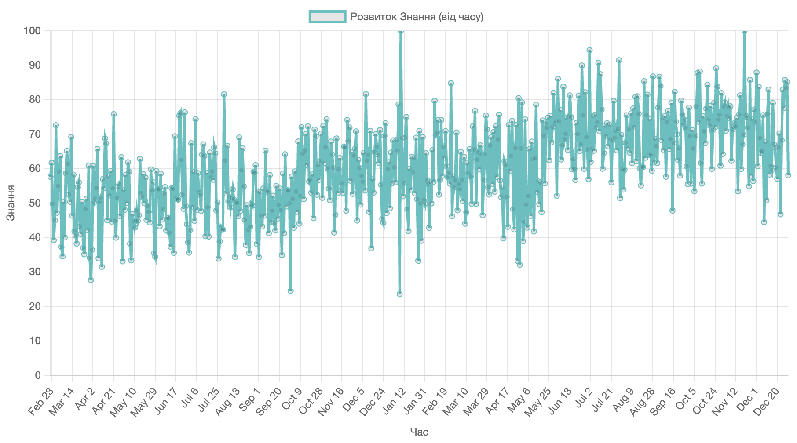
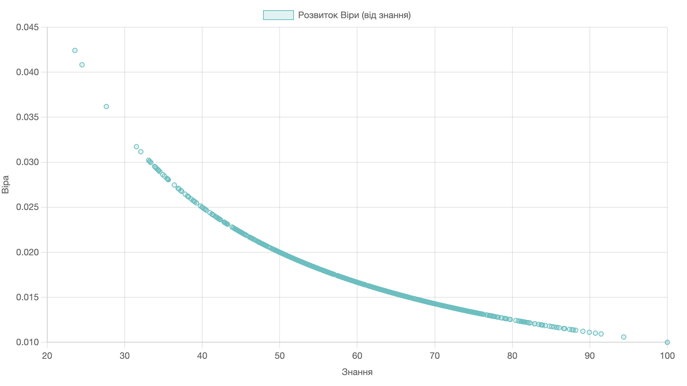

Belief-Knowledge Model
===

## Philosophy

I think that the less **Knowledge** we have about some things the more we tend to **Believe** if someone else tell us something about. Examples:
- We don't know what is sun but if someone told us it's god we believe it. But as soon we know more, we evolve or knowledge we then less believers that sun is god.
- We don't know when war will end, but if someone tells us it will be in three days we tend to believe. As soon as our knowledge evolve, we realize many things, we become less believers.

Other people say:

- Bertrand Russell: The philosopher Bertrand Russell is often associated with the idea that knowledge and certainty are inversely related. He stated, "The fundamental cause of the trouble is that in the modern world, the stupid are cocksure while the intelligent are full of doubt." This sentiment suggests that those with more knowledge or intelligence may be more cautious in their beliefs.

- Carl Sagan: Carl Sagan, a popular science communicator, expressed a similar idea in his book "The Demon-Haunted World: Science as a Candle in the Dark." He emphasized the importance of scientific thinking and skepticism, stating, "I believe that the extraordinary should certainly be pursued. But extraordinary claims require extraordinary evidence."


## Math


A linear equation where y decreases as x increases. It represents a straight line with a slope of -1 and a y-intercept of 1.

```
y = 1−x
```

In an **inversely proportional** relationship between two variables, y and x, the relationship is typically expressed as:

```
y = k/x
```
where `k` is a constant of proportionality. 

A hyperbolic function where y is equal to the **reciprocal** of x: 

```
y = 1/x
```

Knowledge formula:

```
K(t) = scaleFactor * ln(t - t0 + 1)
```
Note: ChatGPT states that <kbd>logarithm (t - t0 + 1)</kbd> is frequent used for accumulative nature of knowledge or experience results, etc. Is commonly used in various areas of mathematics and science, particularly in calculus and the analysis of exponential growth or decay

Belief formula:

```
B(t) = 1 / K(t)
```




